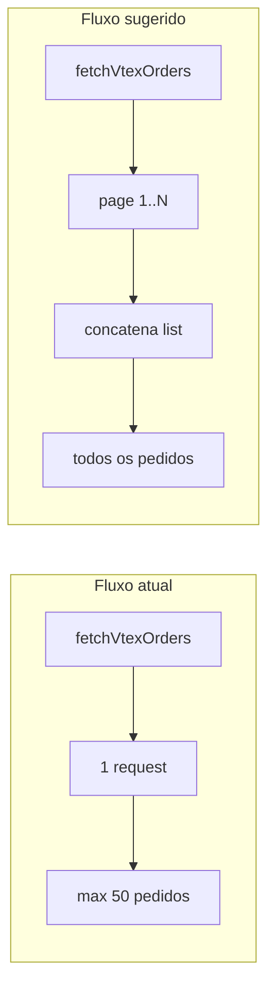
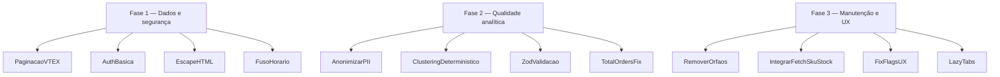

# Crystal — Análise Técnica e Pontos de Melhoria

Documento de auditoria do projeto Crystal. Lista vulnerabilidades, bugs de lógica, débitos técnicos e oportunidades de evolução **sem alterar o fluxo atual** da aplicação.

**Escopo:** Next.js 16 App Router → Server Actions → serviços de análise → dashboard React → chat Gemini.

---

## Sumário executivo

O Crystal tem uma arquitetura limpa e bem testada na camada de serviços. Os principais riscos estão em **segurança de deploy** (sem autenticação), **qualidade dos dados** (paginação VTEX incompleta, fuso horário) e **débitos técnicos** acumulados (componentes órfãos, validação fraca de entrada). Nenhuma mudança proposta aqui altera o pipeline existente — apenas aponta onde melhorar.

| Prioridade | Itens | Impacto |
|------------|-------|---------|
| Alta | Paginação VTEX, autenticação, XSS no relatório, fuso horário | Dados errados ou exposição em produção |
| Média | PII no Gemini, clustering não determinístico, Zod, `totalOrders` | Qualidade analítica e privacidade |
| Baixa | Componentes órfãos, `fetchSkuStock`, flags de UX | Manutenção e experiência |

---

## 1. Vulnerabilidades de segurança

### 1.1 Sem autenticação — Crítico

**Onde:** [`backend/actions/analysis.ts`](../backend/actions/analysis.ts), [`backend/actions/chat.ts`](../backend/actions/chat.ts), [`app/page.tsx`](../app/page.tsx)

**Problema:** Não há login, sessão, JWT nem middleware. Qualquer pessoa com acesso à URL pode:
- Disparar `runAnalysis()` e consumir cota da API VTEX
- Enviar mensagens ao Gemini via `sendChatMessage()`
- Ver todos os dados operacionais da loja

**Contexto:** As credenciais VTEX e Gemini ficam no servidor (`process.env`), o que está correto. O risco é **exposição da aplicação**, não vazamento direto das chaves.

**Sugestão:** [NextAuth v5 (Auth.js)](https://authjs.dev/) com provider de credenciais (`AUTH_PASSWORD`) para single-tenant, ou OAuth para times. Uma página protegida + middleware bastam.

---

### 1.2 XSS no relatório HTML — Médio

**Onde:** [`frontend/lib/report.ts`](../frontend/lib/report.ts)

**Problema:** Nomes de produtos, descrições de alertas, IDs de clientes e ações recomendadas são interpolados diretamente no HTML exportado, sem escape. Se um campo vindo da VTEX contiver `<script>` ou atributos maliciosos, o relatório pode executar código ao ser aberto.

**Exemplo de vetor:** Nome de produto `"><script>alert(1)</script>` renderizado em `<td>${product.name}</td>`.

**Sugestão:** Função `escapeHtml()` aplicada em todos os pontos de interpolação de strings dinâmicas.

---

### 1.3 PII enviada ao Gemini — Médio

**Onde:** [`backend/actions/chat.ts`](../backend/actions/chat.ts) — função `buildSystemPrompt()`

**Problema:** O system prompt inclui `clientId` dos alertas de fraude, que pode ser e-mail ou nome real do cliente. Esses dados são enviados a um serviço de terceiro (Google) sem anonimização.

```typescript
// Trecho atual — fraudSummary usa clientId diretamente
.map((f) => `- ${f.clientId}: score ${f.score}/100 (${f.riskLevel})`)
```

**Sugestão:** Substituir identificadores por hash SHA-256 truncado no momento do envio ao LLM. Manter o ID original apenas no dashboard local.

---

### 1.4 Ausência de rate limiting — Médio

**Onde:** Server Actions `runAnalysis` e `sendChatMessage`

**Problema:** Cada refresh do dashboard ou mensagem no chat dispara chamadas externas sem limite. Um usuário (ou bot) pode esgotar cota VTEX/Gemini rapidamente.

**Sugestão:**
- Servidor: [@upstash/ratelimit](https://github.com/upstash/ratelimit) ou limitador in-memory por IP/sessão
- Cliente: debounce no botão de refresh e no envio de mensagens do chat

---

### 1.5 Datas sem validação no servidor — Baixo

**Onde:** [`backend/actions/analysis.ts`](../backend/actions/analysis.ts) recebe `startDate`/`endDate` de [`frontend/components/DateRangeFilter.tsx`](../frontend/components/DateRangeFilter.tsx)

**Problema:** As strings de data são repassadas diretamente para a query `f_creationDate` da VTEX. A validação existe apenas no cliente (`validateDateRange`). Um request manipulado poderia injetar valores inesperados na query.

**Sugestão:** Validar formato ISO 8601 no servidor (idealmente com Zod) antes de chamar `fetchVtexOrders()`.

---

## 2. Bugs e problemas de lógica

### 2.1 Paginação VTEX incompleta — Alto

**Onde:** [`backend/services/vtex.service.ts`](../backend/services/vtex.service.ts)

**Problema:** Apenas uma requisição é feita por chamada. No modo filtrado, `perPage: 50` é usado; no SSR inicial, o default da VTEX retorna poucos registros. Lojas com mais de 50 pedidos no período têm dados **truncados**, afetando clustering, RFM, forecast e health score.

**Evidência:** `fetchVtexOrders()` retorna `json.list` de uma única página, sem loop em `paging.pages`.

**Sugestão:** Implementar paginação automática usando `paging.total` e `paging.pages` da resposta VTEX.



---

### 2.2 Fuso horário do servidor vs. loja — Médio

**Onde:** [`backend/services/normalization.service.ts`](../backend/services/normalization.service.ts)

**Problema:** `hourOfDay` e `dayOfWeek` são extraídos com `creationDate.getHours()` e `getDay()`, que usam o fuso do **servidor** (UTC na Vercel). A loja opera em BRT (UTC-3), gerando clusters de horário incorretos.

```typescript
// Linha 77-78 — usa hora local do servidor
hourOfDay: creationDate.getHours(),
dayOfWeek: creationDate.getDay(),
```

**Sugestão:** Usar `Intl.DateTimeFormat` com `timeZone: "America/Sao_Paulo"` ou parsear o offset da string ISO da VTEX.

---

### 2.3 Clustering não determinístico — Médio

**Onde:** [`backend/services/kprototype.service.ts`](../backend/services/kprototype.service.ts) — `initializeCentroids()`

**Problema:** Centroides iniciais são escolhidos com `Math.random()`. Cada refresh produz clusters diferentes com os mesmos dados, confundindo o usuário e dificultando comparações entre períodos.

**Sugestão:** Inicialização determinística — centroides espaçados uniformemente nos dados, ou LCG (Linear Congruential Generator) com seed fixa.

---

### 2.4 `totalOrders` conta itens, não pedidos — Médio

**Onde:** [`backend/services/diagnostics.service.ts`](../backend/services/diagnostics.service.ts) — `buildProductStats()`

**Problema:** `stat.totalOrders += 1` é executado **por linha de item**, não por pedido único. Um pedido com 3 unidades do mesmo SKU incrementa `totalOrders` em 3, distorcendo taxa de cancelamento, ABC e recomendações.

**Sugestão:** Manter um `Set<orderId>` por produto e incrementar `totalOrders` apenas uma vez por pedido.

---

### 2.5 `isDataModified` com lógica incorreta — Baixo

**Onde:** [`frontend/components/Dashboard.tsx`](../frontend/components/Dashboard.tsx)

**Problema:** A comparação `dashboardData !== baselineData` é por referência. Após `setState`, ambos os objetos são novas instâncias, mas são setados juntos no refresh — o botão "Limpar" depende de `dateFilterMode !== "all"` em vez de detectar importação de JSON.

**Sugestão:** Flag booleano `hasBeenModified` setado apenas no import de JSON via `handleFileUpload`.

---

### 2.6 `reportDate` usa pedido arbitrário — Baixo

**Onde:** [`frontend/lib/mapper.ts`](../frontend/lib/mapper.ts)

**Problema:** `reportDate` usa `orders[0].creationDate` — o primeiro da lista, não necessariamente o mais recente.

**Sugestão:** Usar a data do pedido mais recente: `Math.max(...orders.map(o => new Date(o.creationDate).getTime()))`.

---

### 2.7 `perdaEstimada` superestima a perda — Baixo

**Onde:** [`frontend/lib/mapper.ts`](../frontend/lib/mapper.ts)

**Problema:**
```typescript
const perdaEstimada = receitaTotal * (taxaCancelamento / 100);
```
Assume que pedidos cancelados tinham o mesmo ticket médio de todos os pedidos. Quando cancelamentos são de tickets baixos, a perda é superestimada.

**Sugestão:** Somar `totalValue` dos pedidos com `statusRaw === "canceled"` diretamente.

---

### 2.8 `validateDateRange` mistura local e UTC — Baixo

**Onde:** [`frontend/lib/vtex-dates.ts`](../frontend/lib/vtex-dates.ts)

**Problema:** `validateDateRange` compara com `new Date(\`${startStr}T00:00:00\`)` (local), enquanto `calendarDateToVtexIso` gera bounds em UTC. Próximo à meia-noite, uma data válida localmente pode falhar após conversão.

**Sugestão:** Padronizar toda comparação de datas usando timestamps UTC.

---

## 3. Débitos técnicos

### 3.1 Componentes órfãos

| Arquivo | Status |
|---------|--------|
| [`frontend/components/AnomalyTab.tsx`](../frontend/components/AnomalyTab.tsx) | Não importado em `Dashboard.tsx` |
| [`frontend/components/DiagnosticsTab.tsx`](../frontend/components/DiagnosticsTab.tsx) | Não importado em `Dashboard.tsx` |

A funcionalidade foi reimplementada em `RisksTab` e `OpportunitiesTab`. São dead code — remover ou integrar.

---

### 3.2 Dependência `ml-kmeans`

**Onde:** `package.json` e [`backend/services/kmeans.service.ts`](../backend/services/kmeans.service.ts)

**Observação:** A lib **é utilizada** em `kmeans.service.ts` (`import { kmeans } from "ml-kmeans"`). Não é dead dependency. Porém, não há seed determinística — ver item 2.3.

---

### 3.3 `fetchSkuStock` não integrado

**Onde:** [`backend/services/inventory.service.ts`](../backend/services/inventory.service.ts)

**Problema:** `fetchSkuStock()` chama a API de logística VTEX (`/api/logistics/pvt/inventory/skus/{skuId}`), mas `buildInventory()` usa apenas estimativa (`avgDailySales * 15`). Dados reais de estoque estão disponíveis e não são usados.

**Sugestão:** Integrar para SKUs classe A (top receita), com fallback para estimativa e limite de chamadas paralelas.

---

### 3.4 Ausência de validação de schema

**Pontos sem validação:**

| Entrada | Validação atual |
|---------|-----------------|
| Resposta VTEX OMS | `as VtexOrdersResponse` (type assertion) |
| Opções de `runAnalysis` | Nenhuma |
| JSON importado no dashboard | Apenas `parsed.overview && parsed.clusters` |

**Sugestão:** [Zod](https://zod.dev/) nos três pontos de entrada.

---

### 3.5 Payload do chat muito grande

**Onde:** [`frontend/components/MentorChat.tsx`](../frontend/components/MentorChat.tsx) → `sendChatMessage(messages, dashboardState)`

**Problema:** O `DashboardData` completo é serializado a cada mensagem. Com centenas de clusters/produtos, o payload pode passar de 100KB.

**Sugestão:** Extrair resumo condensado (KPIs, top 5 alertas, top 3 clusters) antes de enviar ao servidor.

---

## 4. Tecnologias e libs que podem agregar

### 4.1 Validação — Zod

Substituir type assertions por schemas nos pontos de entrada. Falha explícita com mensagem em português quando VTEX retorna shape inesperado.

### 4.2 Autenticação — NextAuth v5

Provider de credenciais com `AUTH_PASSWORD` para single-tenant. Integração estimada em menos de 50 linhas + middleware.

### 4.3 Cache — `unstable_cache` ou Redis

`runAnalysis` é caro (N requests VTEX + ML). Cache por range de datas:
- Serverless: `unstable_cache` do Next.js (in-memory por invocação)
- Persistente: [@upstash/redis](https://github.com/upstash/upstash-redis)

### 4.4 Estado assíncrono — TanStack Query

Substituir `useState` + `runAction` manual por `@tanstack/react-query` com cache, refetch e loading/error declarativos.

### 4.5 Loading — `useTransition` (React 19)

Substituir `isRefreshing` boolean por `useTransition` nativo. Zero dependência adicional; UI permanece interativa durante Server Action.

### 4.6 Gráficos — Nivo heatmaps

Recharts cobre bar/pie/line. Para distribuição RFM e clusters, [@nivo/heatmap](https://nivo.rocks/heatmap/) seria mais rico (tree-shakeable, SSR-friendly).

### 4.7 Monitoramento — Sentry

Erros em Server Actions (VTEX fora, Gemini 429) não têm observabilidade. [@sentry/nextjs](https://docs.sentry.io/platforms/javascript/guides/nextjs/) com config mínima; gratuito para projetos pequenos.

### 4.8 Testes de componente — Testing Library

Cobertura atual é forte em serviços (16 unit + 3 integration), mas zero testes de componentes React. `@testing-library/react` + `jsdom` no Vitest.

---

## 5. Melhorias de performance

### 5.1 Paginação com streaming

Exibir dados parciais enquanto VTEX retorna páginas adicionais via `AsyncGenerator` no Server Action. Melhora percepção de velocidade em lojas grandes.

### 5.2 Lazy loading das abas

Cada tab (`ClustersTab`, `RelationshipTab`, etc.) com `React.lazy` + `Suspense`. Reduz bundle inicial.

### 5.3 Memoização nos serviços

`runKPrototypes` e `buildDiagnostics` são as etapas mais pesadas. Cache baseado em hash dos dados de entrada evita recálculo em refresh com mesmo período.

---

## 6. O que está bem feito

Pontos positivos que **não precisam mudar**:

- **Arquitetura em camadas:** `actions` → `services` → `types`, com `mapper` desacoplando backend do frontend
- **Server Actions** como único boundary server — sem API routes desnecessárias
- **Cobertura de testes** nos serviços de análise (normalization, k-prototypes, RFM, fraud, forecast, alerts, mapper, etc.)
- **Discriminated union** para erros (`{ success: true, data } | { success: false, error }`)
- **Credenciais server-only** — VTEX e Gemini nunca expostas ao cliente
- **UI em português** consistente em copy, erros e prompts de IA
- **CI** com lint, test e build em [`.github/workflows/ci.yml`](../.github/workflows/ci.yml)

---

## 7. Roadmap sugerido (sem alterar o fluxo)



| Fase | Itens | Esforço estimado |
|------|-------|------------------|
| 1 | Paginação VTEX, auth, XSS, timezone | 2–3 dias |
| 2 | PII, clustering seed, Zod, totalOrders | 1–2 dias |
| 3 | Dead code, estoque real, UX, lazy tabs | 1–2 dias |

---

## 8. Referência de arquivos críticos

| Área | Arquivos principais |
|------|---------------------|
| Orquestração | `backend/actions/analysis.ts`, `backend/actions/chat.ts` |
| Dados externos | `backend/services/vtex.service.ts`, `backend/services/inventory.service.ts` |
| ML / heurísticas | `backend/services/kprototype.service.ts`, `backend/services/kmeans.service.ts`, `backend/services/diagnostics.service.ts` |
| Apresentação | `frontend/lib/mapper.ts`, `frontend/lib/report.ts`, `frontend/components/Dashboard.tsx` |
| Testes | `tests/unit/`, `tests/integration/` |

---

*Documento gerado em junho/2026. Reflete o estado do repositório na branch `main`.*
